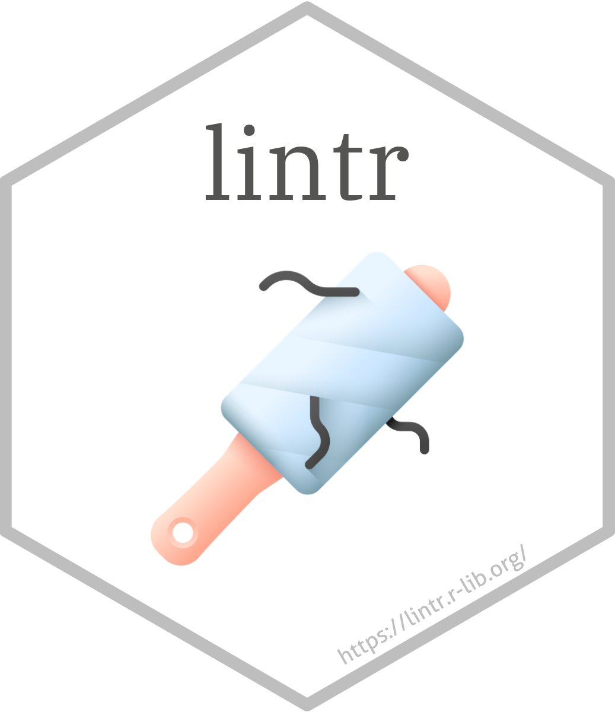

# lintr 

[](https://github.com/r-lib/lintr/actions)
[](https://app.codecov.io/gh/r-lib/lintr?branch=main)
[](https://cran.r-project.org/package=lintr)
[](https://lifecycle.r-lib.org/articles/stages.html)
[](https://doi.org/10.21105/joss.07240)

`{lintr}` provides [static code analysis for
R](https://en.wikipedia.org/wiki/Static_program_analysis). It checks for
adherence to a given style, identifying syntax errors and possible
semantic issues.

For example, given a file `bad.R` with the following contents:

``` r
# Bad R code for demonstration
my_func = function(x){ # Assignment with =
    if(x > 0){ # Missing space before {
        print("Positive")
    }
    else { # else on new line, missing space
        print("Not positive")
    }
    return(T) # Using T instead of TRUE
}
```

Running `lintr::lint()` on this file would produce the following output:

``` r
lintr::lint("bad.R")
```

    ## /tmp/Rtmp80OasP/file2f3544a682c3.R:2:9: style: [assignment_linter] Use one of <-, <<- for assignment, not =.
    ## my_func = function(x){
    ##         ^
    ## /tmp/Rtmp80OasP/file2f3544a682c3.R:2:22: style: [brace_linter] There should be a space before an opening curly brace.
    ## my_func = function(x){
    ##                      ^
    ## /tmp/Rtmp80OasP/file2f3544a682c3.R:2:22: style: [paren_body_linter] Put a space between a right parenthesis and a body expression.
    ## my_func = function(x){
    ##                      ^
    ## /tmp/Rtmp80OasP/file2f3544a682c3.R:3:4: style: [indentation_linter] Indentation should be 2 spaces but is 4 spaces.
    ##     if(x > 0){
    ##   ~^
    ## /tmp/Rtmp80OasP/file2f3544a682c3.R:3:7: style: [spaces_left_parentheses_linter] Place a space before left parenthesis, except in a function call.
    ##     if(x > 0){
    ##       ^
    ## /tmp/Rtmp80OasP/file2f3544a682c3.R:3:14: style: [brace_linter] There should be a space before an opening curly brace.
    ##     if(x > 0){
    ##              ^
    ## /tmp/Rtmp80OasP/file2f3544a682c3.R:3:14: style: [paren_body_linter] Put a space between a right parenthesis and a body expression.
    ##     if(x > 0){
    ##              ^
    ## /tmp/Rtmp80OasP/file2f3544a682c3.R:4:8: style: [indentation_linter] Indentation should be 4 spaces but is 8 spaces.
    ##         print("Positive")
    ##     ~~~^
    ## /tmp/Rtmp80OasP/file2f3544a682c3.R:5:4: style: [indentation_linter] Indentation should be 2 spaces but is 4 spaces.
    ##     }
    ##   ~^
    ## /tmp/Rtmp80OasP/file2f3544a682c3.R:6:5: style: [brace_linter] `else` should come on the same line as the previous `}`.
    ##     else {
    ##     ^~~~
    ## /tmp/Rtmp80OasP/file2f3544a682c3.R:7:8: style: [indentation_linter] Indentation should be 4 spaces but is 8 spaces.
    ##         print("Not positive")
    ##     ~~~^
    ## /tmp/Rtmp80OasP/file2f3544a682c3.R:8:4: style: [indentation_linter] Indentation should be 2 spaces but is 4 spaces.
    ##     }
    ##   ~^
    ## /tmp/Rtmp80OasP/file2f3544a682c3.R:9:5: style: [return_linter] Use implicit return behavior; explicit return() is not needed.
    ##     return(T)
    ##     ^~~~~~
    ## /tmp/Rtmp80OasP/file2f3544a682c3.R:9:13: style: [T_and_F_symbol_linter] Use TRUE instead of the symbol T.
    ##     return(T)
    ##            ~^
    ## /tmp/Rtmp80OasP/file2f3544a682c3.R:11:1: style: [trailing_blank_lines_linter] Remove trailing blank lines.
    ## 
    ## ^

`{lintr}` is complementary to [the `{styler}`
package](https://github.com/r-lib/styler) which automatically restyles
code, eliminating some of the problems that `{lintr}` can detect.

## Installation

Install the stable version from CRAN:

``` r
install.packages("lintr")
```

Or the development version from GitHub:

``` r
# install.packages("remotes")
remotes::install_github("r-lib/lintr")
```

## Usage

And then you can create a configuration file and run selected linters:

``` r
lintr::use_lintr(type = "tidyverse")

# in a project:
lintr::lint_dir()

# in a package:
lintr::lint_package()
```

To see a list of linters included for each configuration:

``` r
# tidyverse (default)
names(lintr::linters_with_defaults())

# full
names(lintr::all_linters())
```

### Setting up GitHub Actions

`{usethis}` provides helper functions to generate lint workflows for
GitHub Actions:

``` r
# in a project:
usethis::use_github_action("lint-project")

# in a package:
usethis::use_github_action("lint")
```

You can also run lintr during continuous integration or within your IDE
or text editor. See `vignette("continuous-integration")` and
`vignette("editors")` for more details.

Without further configuration, this will run the [default
linters](https://lintr.r-lib.org/reference/default_linters.html). See
`vignette("lintr")` to learn how to modify these defaults.

## Code of Conduct

Please note that the lintr project is released with a [Contributor Code
of
Conduct](https://www.contributor-covenant.org/version/2/1/code_of_conduct/).
By contributing to this project, you agree to abide by its terms.
