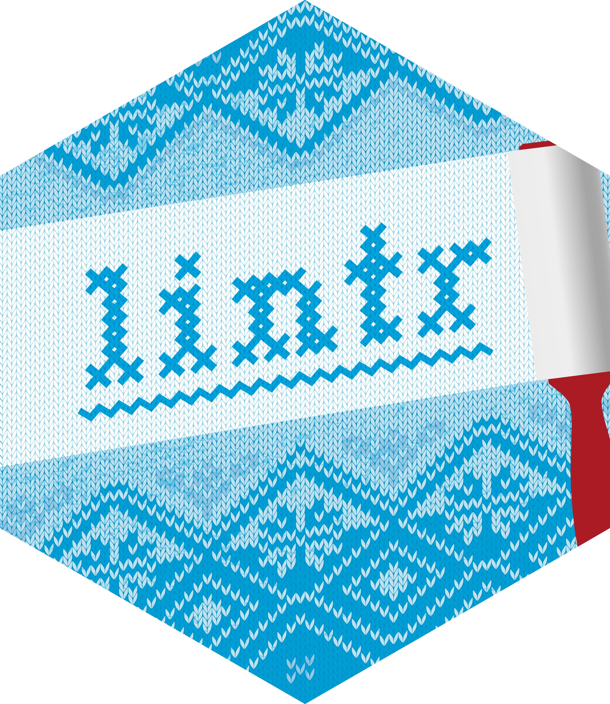
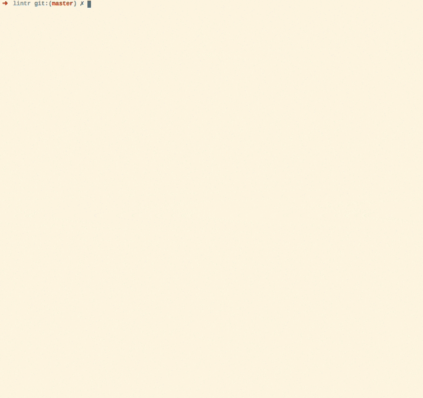

# lintr 

[](https://github.com/r-lib/lintr/actions)
[](https://app.codecov.io/gh/r-lib/lintr?branch=main)
[](https://cran.r-project.org/package=lintr)
[](https://lifecycle.r-lib.org/articles/stages.html)

`{lintr}` provides [static code analysis for R](https://en.wikipedia.org/wiki/Static_program_analysis). It checks for adherence to a given style, identifying syntax errors and possible semantic issues, then reports them to you so you can take action. Watch lintr in action in the following animation:



`{lintr}` is complementary to [the `{styler}` package](https://github.com/r-lib/styler) which automatically restyles code, eliminating some of the problems that `{lintr}` can detect.

## Installation

Install the stable version from CRAN:

```R
install.packages("lintr")
```

Or the development version from GitHub:

```R
# install.packages("remotes")
remotes::install_github("r-lib/lintr")
```

## Usage

And then you can create a configuration file and run selected linters:

```R
lintr::use_lintr(type = "tidyverse")

# in a project:
lintr::lint_dir()

# in a package:
lintr::lint_package()
```

To see a list of linters included for each configuration:

```R
# tidyverse (default)
names(lintr::linters_with_defaults())

# full
names(lintr::all_linters())
```

### Setting up GitHub Actions 

`{usethis}` provides helper functions to generate lint workflows for GitHub Actions:

```R
# in a project:
usethis::use_github_action("lint-project")

# in a package:
usethis::use_github_action("lint")
```

You can also run lintr during continuous integration or within your IDE or text editor. See `vignette("continuous-integration")` and `vignette("editors")` for more details.

Without further configuration, this will run the [default linters](https://lintr.r-lib.org/reference/default_linters.html). See `vignette("lintr")` to learn how to modify these defaults.

## Code of Conduct

Please note that the lintr project is released with a [Contributor Code of Conduct](https://www.contributor-covenant.org/version/2/1/code_of_conduct/). By contributing to this project, you agree to abide by its terms.
