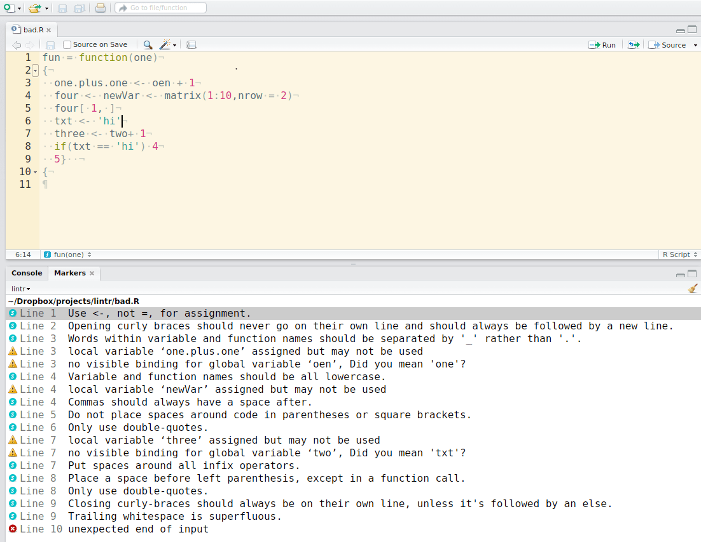
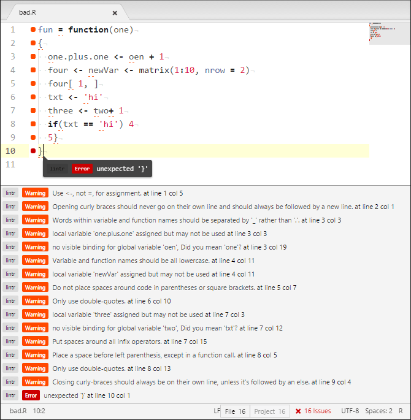
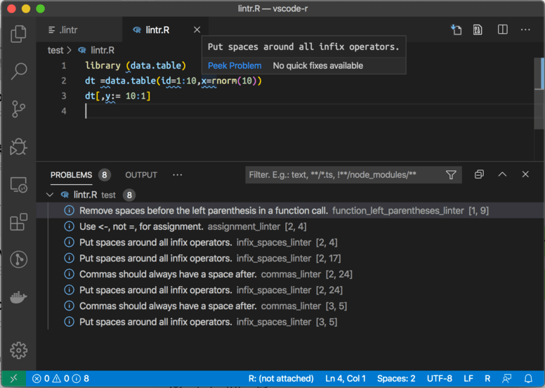

```{r, include = FALSE}
knitr::opts_chunk$set(
  collapse = TRUE,
  comment = "#>"
)

in_pkgdown <- identical(Sys.getenv("IN_PKGDOWN"), "true")

maybe_still <- function(url) {
  if (in_pkgdown) {
    url
  } else {
    gsub("\\.gif$", "-still.gif", url)
  }
}
```

```{r, echo = FALSE, results = 'asis'}
if (!in_pkgdown) {
  cat(
    "Note: This vignette is best viewed [online](https://lintr.r-lib.org/articles/editors.html),",
    "where we can render full animations of editor flows.\n"
  )
}
```

## RStudio

lintr lints are automatically displayed in the RStudio Markers pane (RStudio versions \> v0.99.206).



In order to show the "Markers" pane in RStudio: Menu "Tools" -\> "Global Options...", a window with title "Options" will pop up.
In that window: click "Code" on the left; click "Diagnostics" tab; check "Show diagnostics for R".

To lint a source file `test.R` type in the Console `lintr::lint("test.R")` and look at the result in the "Markers" pane.

This package also includes two addins for linting the current source and package.
To bind the addin to a keyboard shortcut navigate to Tools \> addins \> Browse Addins \> Keyboard Shortcuts.
It's recommended to use Alt+Shift+L for linting the current source lint and Ctrl+Shift+Alt+L to code the package.
These are easy to remember as you are Alt+Shift+L(int) ;)

## Emacs

lintr has [built-in integration](http://www.flycheck.org/en/latest/languages.html#r) with [flycheck](https://github.com/flycheck/flycheck) versions greater than `0.23`.
` "Emacs Example")

### Installation

lintr is fully integrated into flycheck when using [ESS](http://ess.r-project.org/).
See the installation documentation for those packages for more information.

### Configuration

You can also configure what linters are used.
e.g. using a different line length cutoff.
- `M-x customize-option` -\> `flycheck-lintr-linters` -\> `linters_with_defaults(line_length_linter(120))`

## Vim - syntastic

lintr can be integrated with [syntastic](https://github.com/vim-syntastic/syntastic) for on-the-fly linting.

` "Vim Example")

### Installation

Put the file [syntastic/lintr.vim](https://raw.githubusercontent.com/r-lib/lintr/v2.0.1/inst/syntastic/lintr.vim) in `syntastic/syntax_checkers/r`.
If you are using [pathogen](https://github.com/tpope/vim-pathogen) this directory is `~/.vim/bundles/syntastic/syntax_checkers/r`.

You will also need to add the following lines to your `.vimrc`.

``` vim
let g:syntastic_enable_r_lintr_checker = 1
let g:syntastic_r_checkers = ['lintr']
```

### Configuration

You can also configure what linters are used.
e.g. using a different line length cutoff.

``` vim
let g:syntastic_r_lintr_linters = "linters_with_defaults(line_length_linter(120))"
```

## Vim - ALE

lintr can be integrated with [ALE](https://github.com/dense-analysis/ale) for on the fly linting.

### Installation

lintr is integrated with ALE and requires no additional installation.

### Configuration

You can configure what linters are used, e.g. using a different line length cutoff.

``` vim
let g:ale_r_lintr_options = "linters_with_defaults(line_length_linter(120))"
```

You can also configure whether `lint` or `lint_package` is used.
Set to 1 for `lint_package` and 0 (default) for `lint`.

``` vim
let g:ale_r_lintr_lint_package = 1
```

See `:h ale_r_lintr` for more information.

Note that configuration through `.lintr` files are not supported.

There is a work around that can be used to read the contents of a `.lintr` file
in the root of the working directory. This would allow the use of configuration
through `.lintr` files.

``` vim
if filereadable(".lintr")
  let g:ale_r_lintr_options = join(readfile('.lintr'))
endif
```

## Sublime Text 3

lintr can be integrated with [Sublime Linter](https://github.com/SublimeLinter/SublimeLinter) for on-the-fly linting.

` "Sublime Example")

### Installation

Simply install `sublimeLinter-contrib-lintr` using [Package Control](https://packagecontrol.io/).

For more information see [Sublime Linter Docs](http://sublimelinter.readthedocs.io/en/latest/installation.html#installing-via-pc)

### Configuration

You can also configure what linters are used.
e.g. disabling the assignment linter and using a different line length cutoff.
In the SublimeLinter User Settings

```json
    {
      "linters": {
        "lintr": {
          "linters": "linters_with_defaults(assignment_linter = NULL, line_length_linter(120))"
        }
      }
    }
```

## Atom

lintr can be integrated with [Linter](https://github.com/steelbrain/linter) for on the fly linting.



### Installation

Simply install `linter-lintr` from within Atom or on the command line with:

``` bash
apm install linter-lintr
```

For more information and bug reports see [Atom linter-lintr](https://github.com/AtomLinter/linter-lintr).

## Visual Studio Code

In Visual Studio Code, [vscode-R](https://github.com/REditorSupport/vscode-R#r-extension-for-visual-studio-code) presents the lintr diagnostics from [languageserver](https://github.com/REditorSupport/languageserver).



### Installation

Installing `languageserver` package in R and `vscode-R` extension in VS Code will enable lintr in VS Code by default or run the following command lines:

``` bash
Rscript -e 'install.packages("languageserver")'
code --install-extension reditorsupport.r
```
